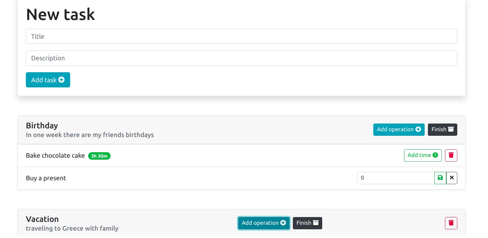

# To Do App

Simple app created with React.js using Hooks. 

User can create tasks, update their status and delete them. User can also add/remove operations to tasks and add time needed to fulfil operation.

